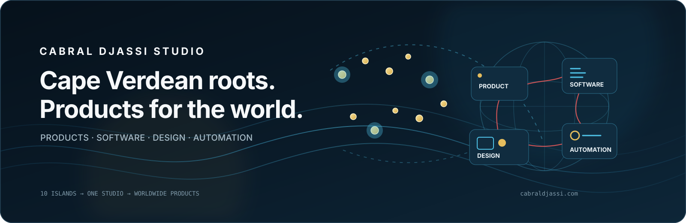

# Cabral Djassi Studio

### Raízes cabo-verdianas. Ambição global. Produtos construídos para durar.

[English](README.md) · [Português](README.pt.md) · [Français](README.fr.md) · [Kabuverdianu](README.cv.md)

[Explorar o Studio](https://cabraldjassi.com/)

---

## Sobre o Studio

A **Cabral Djassi Studio** é um estúdio independente de produtos digitais e software, moldado por Cabo Verde e pensado para utilização global.

Transformamos ideias em produtos reais, combinando pensamento de produto, design de interfaces, engenharia de software, automação, dados e IA quando estas tecnologias acrescentam valor claro. O objetivo não é criar tecnologia por criar, mas construir sistemas úteis, com identidade própria, engenharia sólida e capacidade para evoluir.

O Studio reúne uma família crescente de produtos, plataformas, experiências e sistemas internos. Parte do trabalho é pública; outros projetos permanecem privados enquanto estão em desenvolvimento, validação ou operação.

## O que construímos

- Produtos digitais e plataformas SaaS
- Software operacional e sistemas de back-office
- Experiências Web, mobile-first e PWA
- Workflows assistidos por IA e automação prática
- Dados, dashboards e ferramentas de apoio à decisão
- Plataformas para developers, integrações e ferramentas internas

## Como trabalhamos

**Propósito antes das funcionalidades**  
Uma funcionalidade só merece existir quando resolve um problema real ou melhora o produto de forma relevante.

**Mobile-first, depois expandir**  
As interfaces são concebidas e validadas primeiro para mobile e, depois, adaptadas de forma intencional para tablet e desktop — em vez de simplesmente reduzir um layout de desktop.

**Design com identidade**  
Evitamos experiências genéricas baseadas em templates. Os sistemas visuais devem ser intencionais, claros, humanos e reconhecíveis como próprios.

**Engenharia para a continuidade**  
Arquitetura, segurança, acessibilidade, testes, documentação, manutenção e clareza operacional fazem parte do produto — não são etapas posteriores.

**Raízes locais, padrões globais**  
Cabo Verde molda a nossa perspetiva, mas cada produto é pensado para funcionar entre diferentes utilizadores, dispositivos, línguas, mercados e geografias.

## Cabo Verde no nosso trabalho

Cabo Verde é mais do que o ponto de origem do Studio. Influencia a forma como pensamos sobre capacidade de adaptação, mobilidade, língua, comunidade e produtos destinados a pessoas que vivem em contextos diferentes.

Queremos levar essa perspetiva para a tecnologia sem transformar identidade em decoração: os produtos devem ser contemporâneos e globalmente relevantes, mantendo consciência das suas raízes.

## Repositórios, licenciamento e utilização da marca

O licenciamento é definido por repositório. Produtos comerciais e sistemas internos são, em regra, proprietários, enquanto SDKs públicos, exemplos e componentes selecionados podem utilizar licenças open-source específicas.

Nomes, logótipos, identidades de produto, ilustrações, mascotes, vídeos e outros ativos da marca Cabral Djassi Studio não estão automaticamente licenciados para reutilização. Consulte a [Política de Marca](../BRAND_POLICY.md) e a licença de cada repositório antes de reutilizar código ou materiais de marca.

## Contacto

Para informações oficiais, colaborações, questões sobre produtos ou oportunidades de parceria, utilize os canais disponíveis em [cabraldjassi.com](https://cabraldjassi.com/).

---

Copyright © 2026 Cabral Djassi Studio. Todos os direitos reservados.
